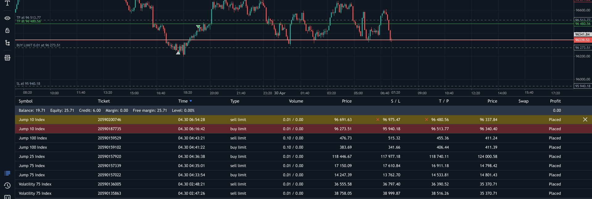

# Deriv MT5 — Placed Order Price Diff Tracker

A Tampermonkey userscript that monitors pending limit orders on the Deriv MT5 web terminal and visually alerts you when the market price is approaching your order's open price.

---

# DEMO



---

## Table of Contents

- [Overview](#overview)
- [Installation](#installation)
- [How It Works](#how-it-works)
- [Visual Indicators](#visual-indicators)
- [Alert System](#alert-system)
- [Adaptive Threshold Logic](#adaptive-threshold-logic)
- [Column Detection](#column-detection)
- [DOM Rendering Note](#dom-rendering-note)
- [Configuration Reference](#configuration-reference)
- [Debugging](#debugging)
- [Limitations](#limitations)

---

## Overview

The script runs every **5 seconds** inside the Deriv MT5 web terminal (`mt5-real01-web-svg.deriv.com`) and scans the pending orders table for rows whose `Profit` column reads `Placed`. For each such row it computes the absolute difference between the **Open Price** (your limit order price) and the **Close Price** (the current live market price), then compares that difference against two adaptive thresholds derived from the order's own open price. Rows are highlighted yellow or red depending on how close the market is to triggering the order, and an audio + desktop notification alert fires when a row enters the red zone.

---

## Installation

1. Install the [Tampermonkey](https://www.tampermonkey.net/) browser extension.
2. Open the Tampermonkey dashboard → **Create a new script**.
3. Delete the default template and paste the full contents of `deriv_price_diff_tracker.user.js`.
4. Save (`Ctrl + S`).
5. Navigate to `http://mt5-real01-web-svg.deriv.com` or `https://mt5-real01-web-svg.deriv.com`.
6. When prompted, click **Allow** to grant desktop notification permission.

> The script will **not run on any other site**. Both the `@match` directives in the header and a runtime hostname guard (`window.location.hostname !== 'mt5-real01-web-svg.deriv.com'`) ensure this.

---

## How It Works

### Startup

On page load (`@run-at document-end`) the script:

1. Checks the hostname and exits immediately if not on the target site.
2. Requests browser notification permission if not already granted.
3. Waits **10 seconds** for the Svelte app to finish rendering the table, then runs the first scan.
4. Schedules a repeat scan every **5 seconds** via `setInterval`.

### Scan cycle (`scan()`)

Each cycle does the following:

```
For each .tbody found in the DOM:
  → Discover column indices from header row title attributes
  → For each .tr[data-id] (order rows only):
      → Read the Profit cell
      → Skip if Profit ≠ "Placed"
      → Parse Open Price and Close Price
      → Compute diff = |Close Price − Open Price|
      → Compute yellowThresh = Open Price × 0.02
      → Compute redThresh    = Open Price × 0.005
      → if diff < redThresh  → paint row RED  + fire alert
      → if diff < yellowThresh → paint row YELLOW
      → else → clear any highlight
```

---

## Visual Indicators

| Colour                                | Condition                   | Meaning                                              |
| ------------------------------------- | --------------------------- | ---------------------------------------------------- |
| **No colour**                         | `diff ≥ 2%` of Open Price   | Order is far from the market — no action needed      |
| **Dim yellow** `rgba(255,200,0,0.35)` | `diff < 2%` of Open Price   | Order is within watch range — market is approaching  |
| **Dim red** `rgba(220,60,60,0.40)`    | `diff < 0.5%` of Open Price | Order is near-trigger — immediate attention required |

Colours are applied by setting `background-color` with `!important` directly on **every `.td` cell** inside the row (not the `.tr` element itself). This is necessary because the table uses CSS Grid layout (`display: grid` on `.tbody`), which makes `.tr` a non-painting box whose own `background` property has no visual effect.

---

## Alert System

When a row enters the **red zone** (`diff < 0.5%`), two things happen simultaneously:

### 1. Audio Alert (`playAlert()`)

Three short rising sine-wave beeps are generated entirely in-browser using the **Web Audio API** — no external sound file is required.

| Beep | Frequency | Start offset |
| ---- | --------- | ------------ |
| 1st  | 660 Hz    | 0.00 s       |
| 2nd  | 880 Hz    | 0.18 s       |
| 3rd  | 1100 Hz   | 0.36 s       |

Each beep fades in over 20 ms and decays over 160 ms. The `AudioContext` is created lazily on first use and reused for subsequent alerts.

### 2. Desktop Notification (`fireAlert()`)

A browser notification is shown with:

- **Title:** `⚠️ Order near market: {Symbol Name}`
- **Body:** the symbol name, current price distance from trigger, and the red threshold value
- **Icon:** the site's own favicon
- **Tag:** `pdiff-{rowId}` — ensures that if the same order fires again, the previous notification is replaced rather than stacking
- **`requireInteraction: true`** — the notification stays on screen until you manually dismiss it

**Clicking the notification** brings the browser window into focus and clicks the matching order row in the table, which opens that symbol's chart in the terminal.

### Cooldown

Each order row (`data-id`) has its alert timestamp stored in the `lastAlerted` map. An alert will not re-fire for the same row within **180 seconds**, preventing spam during the 2-second scan interval.

### Notification Permission

- On first load the script calls `Notification.requestPermission()` — the browser will show a permission prompt.
- If permission is `denied`, notifications are silently skipped (audio still plays).
- If permission is `default` at the time an alert fires, the script requests it again and retries the notification once granted.

---

## Adaptive Threshold Logic

A single flat percentage fails across Deriv's instruments because price scales differ by five orders of magnitude — GBPAUD trades at ~1.87 while Jump 25 Index trades at ~134,000. A 2% threshold on GBPAUD would be hundreds of pips (far too wide), while 2% on Boom 50 at 104,000 is still 2,080 points (too coarse for a fast-moving index).

The script uses a **tiered system**: the open price magnitude selects a tier, and each tier has its own yellow and red fractions calibrated to that instrument class.

### Tier Table

| Price range      | Instrument class                          | Yellow fraction | Red fraction |
| ---------------- | ----------------------------------------- | --------------- | ------------ |
| < 10             | Forex pairs (GBPAUD, EURUSD…)             | 0.3%            | 0.05%        |
| 10 – 500         | Small indices (Vol 50, Vol 100)           | 1.5%            | 0.3%         |
| 500 – 5,000      | Mid indices (Vol 100(1s), Vol 75(1s))     | 1.0%            | 0.2%         |
| 5,000 – 30,000   | Large volatility (Vol 90(1s), Vol 10(1s)) | 0.8%            | 0.15%        |
| 30,000 – 60,000  | Jump/Crash mid (Vol 75, Jump 50)          | 0.6%            | 0.1%         |
| 60,000 – 110,000 | Large Jump/Boom (Jump 10, Boom 50)        | 0.4%            | 0.08%        |
| > 110,000        | Very large indices (Jump 25 and above)    | 0.3%            | 0.06%        |

### Formula

```
tier         = first tier where |openPrice| < tier.maxPrice
yellowThresh = max(|openPrice| × tier.yellowFrac, 1e-9)
redThresh    = max(|openPrice| × tier.redFrac,    1e-9)
```

### Worked examples

| Symbol              | Open Price | Yellow threshold | Red threshold |
| ------------------- | ---------- | ---------------- | ------------- |
| GBPAUD              | 1.87000    | 0.005610         | 0.000935      |
| Volatility 50 Index | 98.51      | 1.4777           | 0.2955        |
| Vol 100 (1s) Index  | 1,298.68   | 12.987           | 2.597         |
| Volatility 75 (1s)  | 4,500.00   | 45.000           | 9.000         |
| Vol 90 (1s) Index   | 10,251.59  | 82.013           | 15.377        |
| Crash 900 Index     | 19,801.06  | 158.408          | 29.701        |
| Volatility 75 Index | 36,415.31  | 218.492          | 36.415        |
| Jump 50 Index       | 44,900.00  | 269.400          | 44.900        |
| Jump 10 Index       | 97,176.73  | 388.707          | 77.741        |
| Boom 50 Index       | 104,404.98 | 417.620          | 83.524        |
| Jump 25 Index       | 134,371.98 | 403.116          | 80.623        |

The `1e-9` floor prevents any comparison issues on theoretical zero-price instruments.

---

## Column Detection

Rather than relying on fragile Svelte-generated class names (e.g. `svelte-6vhlj1`) which change between builds, the script discovers column positions dynamically by reading the **`title` attribute on header cells** (`<div class="th" title="Open Price">`).

The first `.tr` element inside `.tbody` that has **no `data-id` attribute** is treated as the header row. All subsequent `.tr[data-id]` elements are order data rows.

Fallback column indices (used if the header row is not yet rendered):

| Column      | Fallback index |
| ----------- | -------------- |
| Symbol      | 0              |
| Open Price  | 5              |
| Close Price | 8              |
| Profit      | 10             |

---

## DOM Rendering Note

The Deriv MT5 terminal is built with **Svelte** and renders its orders table using **CSS Grid** on the `.tbody` container. In this layout:

- `.tbody` → `display: grid` with explicit `grid-template-columns`
- `.tr` → a grid row container, but **not a painting box** — `background-color` set on `.tr` has no visual effect regardless of CSS specificity or `!important`
- `.td` → the actual rendered cells

This is why earlier versions of the script (which set `background` on `.tr` via injected stylesheets) produced no visible colour change even though the attributes were correctly applied. The solution is to set `background-color` inline on **each `.td`** directly using `element.style.setProperty('background-color', color, 'important')`.

---

## Configuration Reference

All tunable values are constants at the top of the script:

| Constant            | Default                | Description                                                  |
| ------------------- | ---------------------- | ------------------------------------------------------------ |
| `INTERVAL_MS`       | `5000`                 | Scan frequency in milliseconds                               |
| `YELLOW_BG`         | `rgba(255,200,0,0.35)` | Yellow highlight colour                                      |
| `RED_BG`            | `rgba(220,60,60,0.40)` | Red highlight colour                                         |
| `ALERT_COOLDOWN_MS` | `180000`               | Minimum ms between alerts for the same row (180 s)           |
| `THRESHOLD_TIERS`   | (array)                | Tiered fraction table — see Adaptive Threshold Logic section |

To adjust sensitivity for a specific instrument class, find its tier in `THRESHOLD_TIERS` and modify `yellowFrac` and/or `redFrac`. For example, to widen the watch zone for Forex pairs change the first tier's `yellowFrac` from `0.003` to `0.005`.

---

## Debugging

Each scanned order row gets two debug attributes stamped on the `.tr` element, visible in browser DevTools:

| Attribute              | Value                                                |
| ---------------------- | ---------------------------------------------------- |
| `data-price-diff`      | Absolute difference between Close and Open Price     |
| `data-price-threshold` | The yellow threshold value (2% of open)              |
| `data-pdiff-highlight` | Current paint colour, or absent if row is uncoloured |

To inspect: open DevTools → Elements tab → find a `.tr[data-id]` element → check its attributes.

---

## Limitations

- **Notification click → chart navigation** scrolls the matching row into view and clicks it to open the symbol chart. If the terminal's internal routing changes this behaviour, the click may not switch the chart but the window focus and row scroll will still work.
- The script only runs while the browser tab is open and active enough to execute JavaScript. If the tab is suspended by the browser, scans will pause.
- Audio requires at least one prior user interaction with the page (browser autoplay policy). In practice this is always satisfied since you must have clicked to log in.
- If Deriv updates the terminal build and changes the `title` attributes on header cells, column detection will fall back to hardcoded indices (which may be wrong). Check the fallback values against the live DOM if highlighting stops working after a site update.
